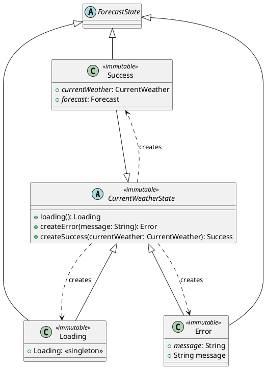
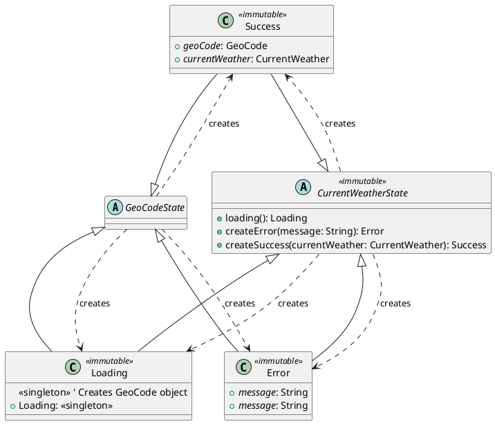

# Model Package
---
## Purpose

The `model` package contains data structures that:
1. Single Source of Truth (SSOT) for data in the application.
2. Implement data classes to represent REST API responses.
3. Sealed classes for handling JSON query succes or error responses.
4. Represents Data Transfer Object (DTO) intermediary between repository, ViewModel, and UI layers.

---
## Class Relationships in Model Package
````plantuml
@startuml
package model {

    class Coordinate  <<immutable>> {
        + <i>longitude</i>: Double
        + <i>latitude</i>: Double
    }
    
    class GeoCode {
        + name: String  
        + state: String  
        + zipCode: String  
        + country: String  
        + longitude: Double  
        + latitude: Double  
        + timezone: Double Int  
        + coordinate(): Coordinate 
        + getTitle(): String
    }
    
    class Clouds <<immutable>> {
        + <i>all</i>: String
        + I<i>percentCloudiness</i>: Int
    }
    
    class Wind <<immutable>> {
        + <i>speed</i>: Double
        + <i>gust</i>: Double
        + <i>direction</i>: Double
    }
    
    class WeatherItem <<immutable>> {
        + <i>id</i>: Int
        + <i>phenomena</i>: String
        + <i>description</i>: String
        + <i>iconId</i>: String
    }
    
    class Main <<immutable>> {
        + <i>temperature</i>: Double
        + <i>temperatureFeelsLike</i>: Double
        + <i>lowTemperature</i>: Double
        + <i>highTemperature</i>: Double
        + <i>pressure</i>: Double
        + <i>percentHumidity</i>: Double
    } 
    
    class Sys <<immutable>>{
        + <i>country</i>: String
        + <i>sunrise</i>: Long
        + <i>sunset</i> Long
    }
    
    class CurrentWeather {
        + <i>coordinate</i>: Coordinate
        + <i>weatherItems</i>: List<WeatherItem>
        + <i>main</i>: Main
        + <i>wind</i>: Wind
        + <i>clouds</i>: Clouds
        + <i>sys</i>: Sys
        + <i>visibility</i>: Int
        + <i>timezone</i>: Int
        + <i>unixTime</i>: Long
        + <i>cityName</i>: String
        + String state: String
    }    

    CurrentWeather "1" --right- "1" Wind
    CurrentWeather "1" --right- "1" Sys
    CurrentWeather "1" -up-- "1" Clouds
    CurrentWeather "1" -up-- "1" Main
    
    class City <<immutable>> {
        + <i>name</i>: String
        + <i>state</i>: String
        + <i>country</i>: String
        + <i>coordinate</i>: Coordinate
        + <i>timezone<i>: Int
        + <i>zipCode</i>: String
    }
    
    ' Class Temperature
    class Temperature <<immutable>> {
        + <i>day</i>: Double
        + <i>min</i>: Double
        + <i>max</i>: Double
        + <i>night</i>: Double
        + <i>evening</i>: Double
        + <i>morn</i>: Double
    }
    
    ' Class FeelsLike
    class FeelsLike <<immutable>> {
    + <i>day</i>: Double
    + <i>night</i>: Double
    + <i>evening</i>: Double
    + <i>morn</i>: Double
    }
    
    ' Class ForecastRecord
    class ForecastRecord  <<immutable>> {
        + <i>sunrise</i>: Long
        + <i>sunset</i>: Long
        + <i>temperature</i>: Temperature
        + <i>feelsLike</i>: FeelsLike
        + <i>pressure</i>: Double
        + <i>humidity</i>: Double
        + <i>windSpeed</i>: Double
        + <i>windGusts</i>: Double
        + <i>windOrientation</i>: Double
        + <i>percentCloudiness</i>: Double
        + <i>precipitationProbability</i>: Double
        + <i>rainVolume</i>: Double
        + <i>weatherItems</i>: List<WeatherItem>
    }
    ForecastRecord "1'" *--down--o "1" Temperature
    ForecastRecord "1'"*--down--o "1" FeelsLike
    
    ' Class Forecast
    class Forecast  <<immutable>> {
        + <i>city</i>: City
        + <i>numberOfForecasts</i>: Int
        + <i>forecastRecords</i>: List<ForecastRecord>
    }
    
    Coordinate "1" *--down--o "1" City 
    Coordinate "1" *--up--o "1"  CurrentWeather
    
    WeatherItem "*" --left--* "1" ForecastRecord
    WeatherItem "*" --right--* "1" CurrentWeather
    
    
    ' Relationships
    

    City "1" o--down-- "1" Forecast
    Forecast "1" *--down-- "1..*" ForecastRecord
}
@enduml
```

---
## Classes in This Package
Classes in the package are fairly simple.

### Classes Related to Geographic Locations
#### Sealed GeoCodeState
- Abstract class that represents result of API request for GeoCode instance.
- Concrete subclasses of GeoCodeState:
    - **Loading** Singleton for creating an instance of GeoCode fromAPI response.
    - **Success** Returns a  GeoCode instance if API request was successful.
    - **Error** Holds error message and exceptions thrown if the API request fails.

---
### Weather Related Classes

#### Data Objects

#### Sealed CurrentWeatherState
- Holds outcome of CurrentWeather API request. Possible states:
  - Loading
  - Success
  - Error
- Enforces error handling contract
-  Simplifies error handling

sealed class GeoCodeState  <<immutable>> {
object Loading : GeoCodeState()
data class Success(val geoCode: GeoCode) : GeoCodeState()
data class Error(val message: String) : GeoCodeState() // Represents an error state with a message
}


---
### Forecast Related Classes



`




### Higher Level Class
- Aggregations of 

### 1. **WeatherData**
- Represents the weather information fetched from an API or local cache.
- **Example Fields**:
    - `temperature: Double`
    - `humidity: Int`
    - `weatherCondition: String`

   ```kotlin
   data class WeatherData(
       val temperature: Double,
       val humidity: Int,
       val weatherCondition: String
   )
   ```

### Sealed Class: CurrentWeatherState

`CurrentWeatherState` is a sealed class in Kotlin that represents the different states of weather data loading. It has the following subtypes:

1. **Object**: `Loading`
    - Represents the loading state while fetching weather data.

2. **Data Class**: `Success`
    - Contains the successfully fetched weather data.
    - Fields:
        - `currentWeather: CurrentWeather`

3. **Data Class**: `Error`
    - Represents an error state with a message.
    - Fields:
        - `message: String`


### 2. **Location**
- Represents the user's current or selected location.
- **Example Fields**:
    - `latitude: Double`
    - `longitude: Double`
    - `cityName: String`

   ```kotlin
   data class Location(
       val latitude: Double,
       val longitude: Double,
       val cityName: String
   )
   ```

### 3. **Forecast**
- Represents hourly or daily forecast data.
- **Example Fields**:
    - `date: String`
    - `highTemperature: Double`
    - `lowTemperature: Double`
    - `description: String`

   ```kotlin
   data class Forecast(
       val date: String,
       val highTemperature: Double,
       val lowTemperature: Double,
       val description: String
   )
   ```

---
## Example Usage

The `model` classes are typically used as follows:

- **Repository**: These models act as DTOs (Data Transfer Objects) for data retrieved from external or internal sources.
- **ViewModel and LiveData**: They are shared as observable data between ViewModels and UI components.
- **Serialization**: Models are used for serializing/deserializing data when communicating with APIs.

### Example – Using `WeatherData` in a ViewModel

```kotlin
val weatherData: LiveData<WeatherData> = liveData  <<immutable>> {
    val data = repository.getWeatherForLocation(location)
    emit(data)
}
```

---

## Package Dependencies

The `model` package is self-contained. It does not depend on other packages in the application.

---

## Best Practices
1. **Immutable Data Models**  
   Data classes should be immutable whenever possible. Use `val` for fields.

2. **Separate Concerns**  
   Keep these models tightly focused on data representation. Do not include business logic or UI-related code in this package.

3. **Serialization**  
   Annotate fields for serialization/deserialization if the data is coming from an API. Example for `Gson`:
   ```kotlin
   @SerializedName("temp")
   val temperature: Double
   ```kotlin
4. **Clarity**
    Some fields in JSON response are ambigous. Field names should be descriptive.
---

## Future Improvements
- Simplify GeoCode class.
- Duplicate fields in Forecast and CurrentWeather classes.
- Add validation logic (e.g., using Kotlin contracts or custom validation annotations).
- Define specific response models for each API endpoint if the app becomes more complex.

---

This structure aims to provide clarity for future maintainers and contributors while ensuring the responsibilities of this package are clean and well-documented.
