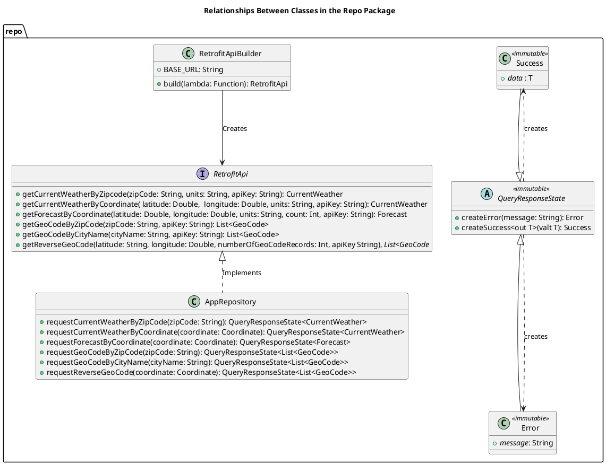

```plantuml
@startuml
title Relationships Between Classes in the Repo Package
package repo {
    ' Abstract class representing the sealed class
    abstract class QueryResponseState  <<immutable>> {
        + createError(message: String): Error
        + createSuccess<out T>(valt T): Success
    }
    
    ' Subclasses
    
    class Success  <<immutable>> {
        + <i>data </i>: T
    }
    
    class Error  <<immutable>> {
        + <i>message</i>: String
    }
    
    ' Inheritance Relationships
    QueryResponseState <|--up- Success
    QueryResponseState <|--- Error
    
    ' Aggregation or Instantiation Relationship
    QueryResponseState ..> Success : creates
    QueryResponseState ..> Error : creates

     class RetrofitApiBuilder {
        + BASE_URL: String
        + build(lambda: Function): RetrofitApi
     }
   
    interface RetrofitApi {
        + getCurrentWeatherByZipcode(zipCode: String, units: String, apiKey: String): CurrentWeather
        + getCurrentWeatherByCoordinate( latitude: Double,  longitude: Double, units: String, apiKey: String): CurrentWeather
        + getForecastByCoordinate(latitude: Double, longitude: Double, units: String, count: Int, apiKey: String): Forecast
        + getGeoCodeByZipCode(zipCode: String, apiKey: String): List<GeoCode>
        + getGeoCodeByCityName(cityName: String, apiKey: String): List<GeoCode>
        + getReverseGeoCode(latitude: String, longitude: Double, numberOfGeoCodeRecords: Int, apiKey String), <i>List<GeoCode</i>
    }
    
    class AppRepository {
        + requestCurrentWeatherByZipCode(zipCode: String): QueryResponseState<CurrentWeather>
        + requestCurrentWeatherByCoordinate(coordinate: Coordinate): QueryResponseState<CurrentWeather>
        + requestForecastByCoordinate(coordinate: Coordinate): QueryResponseState<Forecast>
        + requestGeoCodeByZipCode(zipCode: String): QueryResponseState<List<GeoCode>>
        + requestGeoCodeByCityName(cityName: String): QueryResponseState<List<GeoCode>>  
        + requestReverseGeoCode(coordinate: Coordinate): QueryResponseState<List<GeoCode>>   
    }
    
    RetrofitApi <|.. AppRepository : Implements
    RetrofitApiBuilder ---> RetrofitApi : Creates
}
@enduml
```