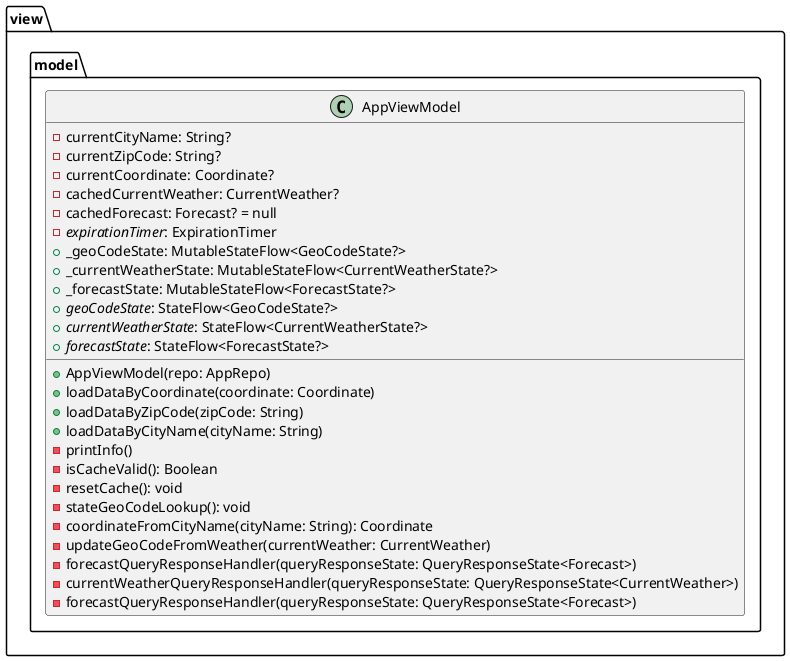
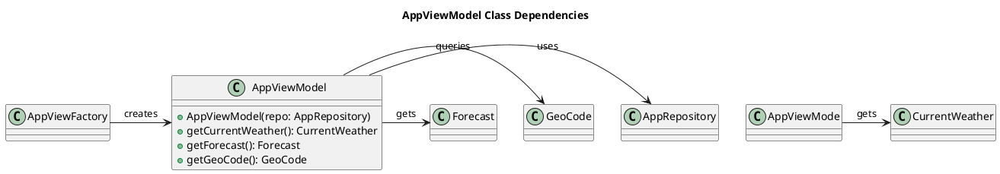

#  Package `com.lawal.banji.yahewa.viewModel`
---
## Purpose

1. Contains ViewModels  that set state through UI controls.
2. Set from MainActivity and Factories.
3. Maintains relationship between: CurrentWeather<-->GeoCode<-->Forecast

## Dependencies
The `viewModel` package depends on

- **Other Packages**:
    -  `com.lawal.banji.yahewa.repo`
    - `com.lawal.banji.yahewa.model`
    -  `com.lawal.banji.yahema.factory`
---
## Main Classes in ViewModelPackage

### AppViewModel
If `GeoCode`, `CurrentWeather`, or `Forecast` have inconsistencies in their
`coordinate` we cannot trust the accuracy or reliability of the location, nor
the weather reports.  `AppViewModel` maintains the relationships between
`GeoCode`, `CurrentWeather`, and `Forecast`.

## Class Relationships in view.model package.

### Class Dependencies
`AppViewModel` depends on:
- **Data Classes**
  - `GeoCode`
  - `CurrentWeather`
  - `Forecast`
  - `Coordinate`
  
- **Builder Classes**
  - `AppViewModelFactory`
  
- **Repository Classes**
  - `AppRepository`

