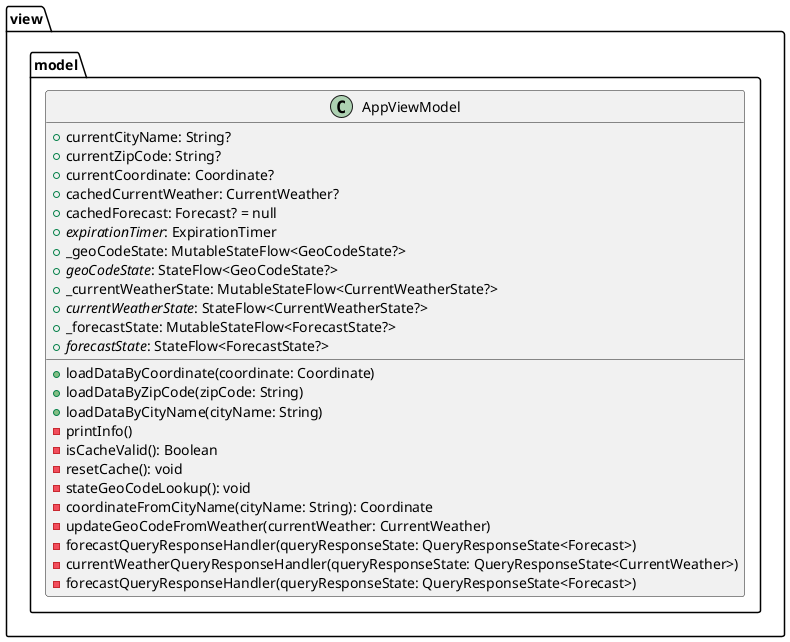

# ViewModel Package
---
## Purpose

1. Contains ViewModels  that set state through UI controls.
2. Set from MainActivity and Factories.
3. Maintains relationship between: CurrentWeather<-->GeoCode<-->Forecast

## Class Relationships in view.model package.
